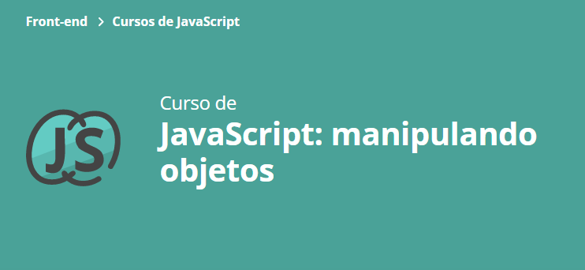

### Projeto Lista de Compras - Utilizado no Curso Objetos no JavaScript - Escola Front-End Alura

### Aula 1: 
- Definiu o que é objetos em JavaScript; :white_check_mark:
- Aprendeu na prática como criar objetos; :white_check_mark:
- Aprendeu como editar e deletar valores de objetos; :white_check_mark:
- Utilizou o conjunto de objetos, métodos e funções do JavaScript para criar funcionalidades no projeto; :white_check_mark:
- Aprendeu a diferença entre var, let e const; :white_check_mark:
- Aprendeu como criar objetos a partir das informações passadas pela pessoa usuária. :white_check_mark:

### Aula 2:
- 

